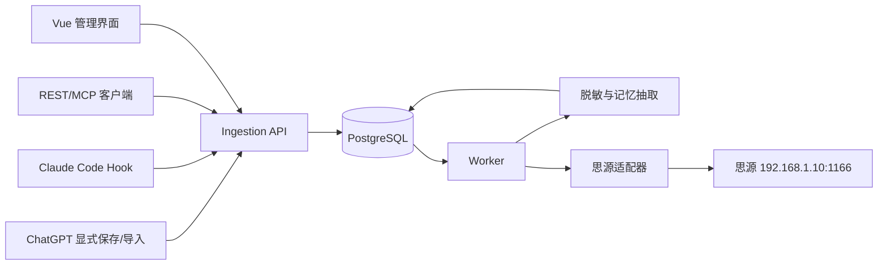

# 系统架构

## 技术选型

- Web：Vue 3、Vite、TypeScript、Naive UI、Vue Router、Pinia、TanStack Query。
- API：Node.js 22、Fastify、Zod、OpenAPI。
- 数据：PostgreSQL 16、Drizzle ORM、`pg_trgm` 和内置全文检索。
- 任务：pg-boss，任务与业务数据共用 PostgreSQL。
- 模型：Provider Adapter，支持 OpenAI-compatible、Anthropic 和 Ollama。
- 测试：Vitest、Vue Test Utils、Fastify inject、Testcontainers、Playwright。

采用 TypeScript monorepo 的原因是浏览器扩展、Claude Code 适配器、前端、API 和 Worker 可以共享事件契约，减少跨语言协议漂移。V1 不采用独立向量库；当关键词检索不足时再以 ADR 形式评估 pgvector。

## 组件图



## 进程边界

### Web

只负责界面和用户交互，不持有思源或模型密钥。通过同源反向代理访问 API。

前端状态按所有权分层：Vue 原生响应式 API 管理组件局部状态，Vue Router 管理可分享的筛选和分页参数，Pinia 管理跨页面客户端状态，TanStack Vue Query 管理 API 服务端状态。详细方案见 [Vue 状态管理工具调研](11-frontend-state-management.md)。

### API

负责鉴权、输入校验、查询、规则配置和任务入队。HTTP 请求内不直接执行 LLM 或思源写入。

### Worker

执行归一化、脱敏、记忆抽取、相似项检查、规则评估、思源交付和失败重试。每项任务都有幂等键。

### PostgreSQL

是唯一业务事实来源，保存事件、候选、版本、规则、归档结果、审计和任务。原始事件按保留策略清理。

## Monorepo 规划

```text
apps/web                 Vue 管理端
apps/api                 Fastify API
apps/worker              异步任务进程
apps/browser-extension   ChatGPT 显式保存扩展，V1 开发阶段加入
packages/contracts       SourceEvent 与 API Schema
packages/database        Drizzle Schema 和迁移
packages/core            领域服务和规则引擎
packages/siyuan          思源 API 适配器
packages/llm             模型 Provider 与结构化抽取
packages/security        脱敏和秘密检测
```

## 可靠性策略

- 客户端使用 `Idempotency-Key`；服务端对来源自然键建立唯一约束。
- API 接收事件后立即持久化并返回，不等待模型处理。
- Worker 使用 pg-boss 的重试、超时和死信机制。
- 思源交付以 `memory_version_id + target_id` 唯一，重试前先检查归档记录。
- 连接器故障只记录本地日志，不阻断 ChatGPT 或 Claude Code 会话。
