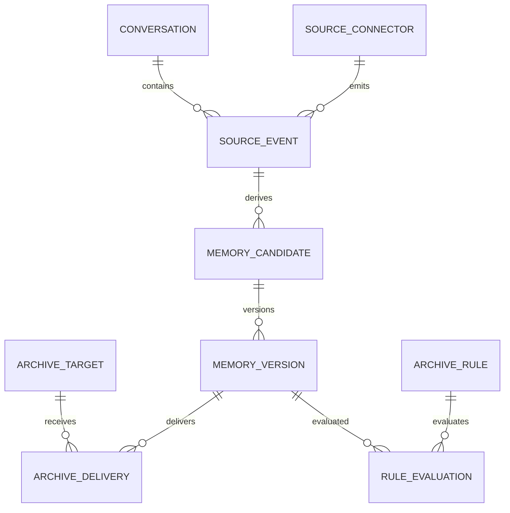

# 领域与数据模型

## 聚合关系



## 主要实体

### `source_connectors`

保存连接器名称、类型、启用状态和 API Key 哈希。密钥只展示一次，数据库不保存明文。

### `conversations`

保存来源会话 ID、标题、项目、仓库、分支、开始/结束时间。不同来源的外部 ID 允许重复，但 `(connector_id, external_id)` 唯一。

### `source_events`

保存标准事件、原始负载、内容指纹、发生时间和处理状态。默认 90 天后清理原始负载，但保留摘要和哈希。

### `memory_candidates`

保存稳定的候选身份：`canonical_key`、当前状态、类型、作用域和冲突状态。候选不会因为内容更新而改变 ID。

### `memory_versions`

保存标题、正文、置信度、敏感等级、有效时间、抽取器版本、来源引用和内容哈希。版本只追加，不原地覆盖。

### `archive_rules`

保存声明式条件和动作。条件字段限定为白名单，不执行用户提供的脚本。规则支持禁用、排序和试运行。

### `archive_targets`

保存思源地址、笔记本 ID、路径模板和鉴权引用。Token 通过 Docker Secret 注入，表中只保存 secret 名称。

### `archive_deliveries`

保存目标文档 ID、块 ID、请求指纹、状态、尝试次数和错误摘要。成功记录不可删除，只能通过补偿操作修正。

### `audit_logs`

记录人工修改、规则命中、自动归档、重试和配置变更。审计记录不存放完整密钥或原始敏感文本。

## 状态机

```text
candidate: pending -> approved -> queued -> synced
                    -> rejected
                    -> conflict
synced -> pending   # 保存有差异的修订
synced -> superseded # 旧版本被新版本替代，不单独作为候选状态

delivery: queued -> processing -> succeeded
                               -> retrying -> dead_letter
```

## 去重与冲突

- 精确幂等：`connector_id + external_conversation_id + external_event_id`。
- 内容去重：标准化文本后计算 SHA-256。
- 语义近似：V1 使用标题、canonical key 和 trigram 相似度提示，不自动合并。
- 冲突：同一 canonical key 出现不兼容内容时标记 `conflict`，禁止自动归档。
- 替代：审核通过的新版本设置 `supersedes_version_id`，旧版本保留 `valid_to`。


## 修订与当前版本

- `memory_candidates` 保存工作副本；`current_version_id` 指向最近一次成功同步的版本。
- 修订保存后候选回到 `pending`，不立刻插入 `memory_versions`。
- 批准时追加新版本和新交付；Worker 优先更新既有思源 `document_id`。
- 成功后切换 `current_version_id`。旧版本只读保留，用于历史和比对。
