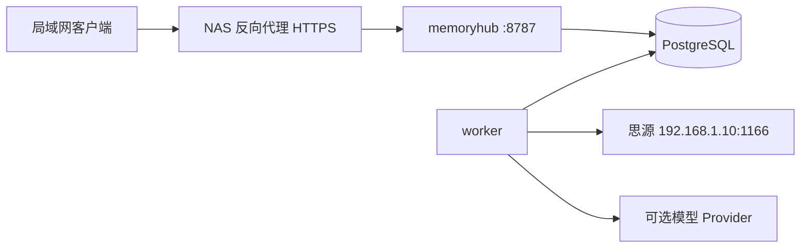

# NAS Docker 部署方案

## 部署拓扑

V1 使用三个容器：`memoryhub`、`worker`、`postgres`。Vue 静态资源由 `memoryhub` 容器同源提供，避免额外 Web 容器和跨域配置。API 与 Worker 使用同一镜像、不同启动命令。



Compose 草案见 [../deploy/compose.design.yaml](../deploy/compose.design.yaml)。镜像名称和版本在业务实现阶段确定，该草案当前不可直接部署。

## NAS 前提

- x86_64 或 arm64 Linux NAS，支持 Docker Compose v2。
- NAS 到 `192.168.1.10:1166` 网络可达。
- 为数据库准备独立持久化目录和快照策略。
- 仅在局域网或 VPN 中开放，不直接映射到公网。

## 目录建议

```text
/volume1/docker/memory-hub/
  compose.yaml
  .env
  data/postgres/
  backup/
  secrets/admin_password
  secrets/siyuan_token
  secrets/llm_api_key
```

secret 文件权限建议设为仅 NAS 管理账号可读。Compose 不把 secret 内容写入环境变量或日志。

## 网络

- `memoryhub` 只暴露 `8787`，PostgreSQL 不发布宿主机端口。
- Worker 通过 NAS 默认 bridge 网络访问思源局域网地址。
- 若 NAS 防火墙启用，允许容器网段到 `192.168.1.10:1166`。
- 公网访问使用 Tailscale/WireGuard，或 NAS 反向代理加 HTTPS 和额外认证。

## 配置

- `SIYUAN_BASE_URL=http://192.168.1.10:1166`
- `SIYUAN_AUTH_HEADER=X-Auth-Token`，按实际思源版本可改为兼容方式。
- `LLM_PROVIDER=disabled` 时允许纯人工流程。
- `MEMORY_HUB_ADMIN_USERNAME` 配置单管理员用户名。
- `MEMORY_HUB_ADMIN_PASSWORD_FILE` 指向管理员初始密码的 Docker Secret 文件；生产环境不允许使用开发默认密码。
- `MEMORY_HUB_SESSION_TTL_MS` 配置登录会话有效期，默认 7 天。
- 数据库密码、管理员密码、思源 Token 和模型密钥必须使用 secret 文件。

## 健康检查

- `/healthz`：进程存活，不访问外部系统。
- `/readyz`：数据库迁移完成且任务系统可用。
- 思源和模型状态在管理页面独立展示，不影响 API readiness，避免外部服务故障导致重启循环。

## 备份恢复

- 每日 `pg_dump --format=custom`，保留 14 个日备份和 3 个月备份。
- PostgreSQL 数据目录使用 NAS 快照，但恢复以逻辑备份为标准流程。
- secret 文件单独离线备份，不与数据库备份放在同一归档。
- 每季度执行一次恢复演练，验证数据库版本、迁移和归档记录。

## 升级

1. 备份数据库并验证备份文件非空。
2. 拉取固定版本镜像，禁止生产环境使用 `latest`。
3. 运行只读迁移检查。
4. 停止 Worker，执行数据库迁移，再更新 API 和 Worker。
5. 检查 health/readiness、死信任务和思源连接。
6. 保留上一版本镜像；数据库迁移必须提供回滚或前滚说明。
