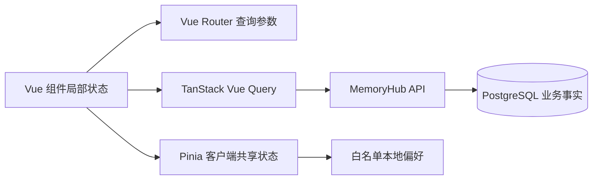

# Vue 状态管理工具调研

状态：**Pinia 选型已确认**  
日期：2026-08-14

## 结论摘要

MemoryHub V1 推荐采用分层状态管理，而不是让一个全局 Store 承担全部职责：

| 状态类型         | 推荐工具                    | 典型内容                                       |
| ---------------- | --------------------------- | ---------------------------------------------- |
| 组件局部状态     | Vue `ref` / `reactive`      | 对话框开关、临时输入、单组件交互状态           |
| URL 状态         | Vue Router query            | 搜索词、筛选条件、排序、分页、当前标签页       |
| 服务端状态       | TanStack Vue Query          | 候选记忆、归档记录、规则、任务状态和连接器信息 |
| 跨页面客户端状态 | Pinia                       | 主题、界面密度、侧栏状态、当前工作上下文       |
| 持久化偏好       | 显式白名单适配器            | 主题、密度等非敏感偏好                         |
| 复杂交互流程     | 暂不引入；必要时评估 XState | 多步骤流程出现大量并行、回退和条件转换时使用   |

已确认使用 Pinia，并继续使用 TanStack Vue Query，但需要明确二者边界。项目将使用 Pinia 4.x；Pinia 官方仓库当前稳定版本为 4.0.3，且与项目现有 Vue 3.5、TypeScript 5.7 基线兼容。

## 调研范围

GitHub 活跃度为 2026-08-14 的页面快照，仅用于判断维护状态，不将 Star 数量作为选型的主要依据。

| 工具                                                | 定位                           | GitHub 快照                                           | 判断                                    |
| --------------------------------------------------- | ------------------------------ | ----------------------------------------------------- | --------------------------------------- |
| [Pinia](https://github.com/vuejs/pinia)             | Vue 全局客户端状态             | 约 14.7k Stars；最新提交 2026-08-12；Vue 核心团队维护 | 首选                                    |
| [Vuex](https://github.com/vuejs/vuex)               | Vue 旧版集中式状态管理         | 约 28.3k Stars；最新提交 2024-09-25                   | 维护模式，新项目不采用                  |
| [TanStack Query](https://github.com/TanStack/query) | 异步服务端状态、缓存和请求协调 | 约 50.1k Stars；最新提交 2026-08-12                   | 保留，与 Pinia 分工                     |
| [VueUse](https://github.com/vueuse/vueuse)          | Vue Composition Utilities 集合 | 约 22.3k Stars；最新提交 2026-08-13                   | 按实际工具需求评估，不作为 Store 替代品 |
| [XState](https://github.com/statelyai/xstate)       | 状态机、状态图和 Actor 模型    | 约 30k Stars；最新提交 2026-08-12                     | V1 不引入，保留为复杂流程备选           |

Vue 官方的[状态管理指南](https://vuejs.org/guide/scaling-up/state-management.html)明确说明：Pinia 由 Vue 核心团队维护，是新应用的推荐方案；Vuex 已进入维护模式，不再增加新功能。

## 方案分析

### Pinia

解决跨组件、跨路由共享的客户端状态，并提供 Vue DevTools、热更新、服务端渲染支持和良好的 TypeScript 推断。

值得采用：

- 与 Vue Composition API 一致，Setup Store 适合当前 TypeScript 代码风格。
- API 简单，测试时可以为每个用例创建独立 Pinia 实例。
- Vue DevTools 可检查状态变化和 Action 调用。
- 官方维护活跃，Vue 新项目默认推荐。

需要避免：

- 不建立包含全部页面数据的单一巨大 Store。
- 不在 Pinia 中复制 TanStack Query 已经管理的 API 响应和缓存状态。
- 不默认持久化整个 Store，避免记忆内容、令牌或敏感筛选信息进入浏览器存储。
- 不让组件绕过 Action 随意修改存在业务约束的共享状态。

### TanStack Vue Query

解决来自 API 的异步状态，包括请求去重、缓存、过期、重试、分页、Mutation 和缓存失效。

MemoryHub 的候选记忆列表、记忆详情、归档记录、规则配置和任务进度都属于服务端事实，应由 Query 管理。Pinia 只保存这些页面的客户端上下文，不保存第二份服务端数据副本。

需要避免：

- 不把 Query Cache 当作永久数据库。
- Mutation 成功后按 Query Key 精确失效，不全局清空缓存。
- 对自动刷新任务设置明确的轮询终止条件和退避策略。
- 搜索、分页和筛选参数优先放入 URL，以便刷新和分享后保持视图一致。

### Vue 原生响应式 API 与 VueUse

`ref`、`reactive` 和组合式函数足以处理局部或小范围共享状态。VueUse 提供 `useStorage`、事件监听和浏览器能力封装，项目需要多个此类能力时再引入。

V1 不因单个持久化需求立即增加 VueUse。安全偏好可以通过一个小型、显式白名单的本地存储适配器实现，避免通用自动持久化扩大敏感数据暴露面。

### Vuex

Vuex 仍可运行，但官方已将其定义为维护模式。它的 Mutation/Action 结构和 TypeScript 使用成本高于 Pinia，且不能为新项目提供明显收益，因此不采用。

### XState

XState 适合状态转换规则复杂、并行状态多、必须显式建模非法转换的流程。MemoryHub 的归档状态是后端领域事实，应优先由 API 和 Worker 状态机保证，不能只在浏览器中建模。

V1 的审核操作以普通 Query Mutation 和后端校验实现。只有当前端出现复杂向导、可中断批处理或多分支恢复流程时，再通过 ADR 评估 XState，避免过早引入双重状态模型。

## MemoryHub 状态边界

### 应放入 Pinia

- 主题模式与信息密度。
- 导航侧栏折叠状态。
- 当前选择的工作区或默认归档目标 ID，前提是其本身不敏感。
- 跨页面但不属于服务端事实的短生命周期 UI 上下文。

### 不应放入 Pinia

- 候选记忆、归档记录和规则的 API 响应副本。
- 原始 ChatGPT 或 Claude Code 对话正文。
- 思源 Token、模型 API Key、会话凭据。
- 分页、搜索词和筛选条件；这些优先进入路由查询参数。
- Worker 任务的权威状态；前端只通过 Query 读取服务端状态。

## 建议工程约定

- 使用 Setup Store，并按业务能力命名，如 `useUiPreferencesStore`，不创建 `useGlobalStore`。
- Store 只暴露有业务含义的 Action；Getter 保持纯计算。
- 组件通过 `storeToRefs` 解构响应式字段。
- Query Key 由集中式工厂生成，避免字符串散落和失效范围错误。
- Pinia Action 不重复封装普通 Query 请求；跨 Store/UI 协调才使用 Action。
- 本地持久化采用字段白名单、版本号和迁移函数，默认不持久化。
- 退出登录或切换用户时清理 Query Cache 和用户作用域的本地偏好。

## 测试策略

- Pinia Store：每个测试创建新的 Pinia 实例，覆盖默认状态、Action 和持久化迁移。
- Query composable：使用独立 QueryClient，关闭自动重试并清理缓存。
- 组件测试：通过 Provider 注入 Pinia 与 QueryClient，验证加载、成功、空状态和错误状态。
- 路由状态：验证 URL 参数与筛选控件双向同步，以及非法参数的默认处理。
- 安全测试：断言敏感字段不会写入 `localStorage`、`sessionStorage` 或 Pinia 持久化数据。

## 风险与控制

| 风险                              | 控制方式                                         |
| --------------------------------- | ------------------------------------------------ |
| Pinia 与 Query 同时保存服务端数据 | 代码评审明确所有权，服务端事实只进入 Query Cache |
| 全局 Store 逐渐膨胀               | 按领域拆分 Store，只保存跨页面客户端状态         |
| 浏览器持久化泄露记忆内容          | 默认关闭持久化，只允许显式白名单字段             |
| Query Key 不一致导致陈旧页面      | 集中维护 Query Key 工厂并测试失效行为            |
| Pinia 4 主版本升级产生兼容变化    | 方案确认后单独升级，执行类型检查、单测和构建     |

## 已确认与后续决策

1. 已确认：Pinia 作为跨页面客户端状态工具。
2. TanStack Vue Query 作为服务端状态与请求缓存工具。
3. Vue Router query 管理可分享、可恢复的页面筛选状态。
4. Vue 原生响应式 API 管理组件局部状态。
5. V1 不引入 Vuex、XState、VueUse 或自动持久化插件。
6. 已完成：Pinia 已从 3.0.4 升级到 4.0.3；业务 Store 开始实现时补充对应测试基线。
