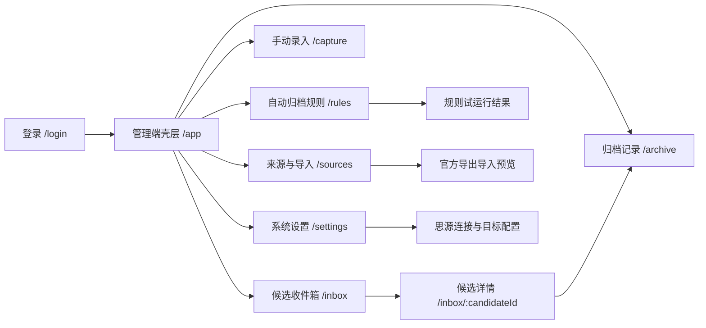
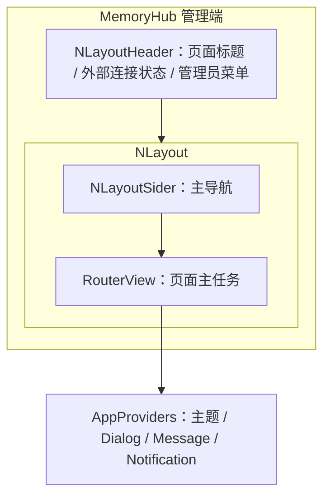
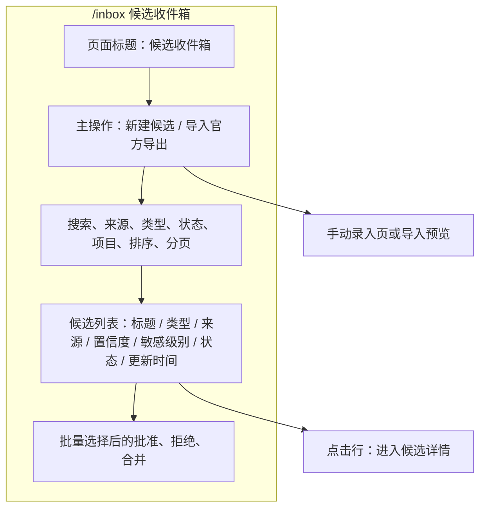
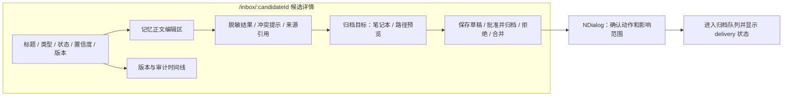
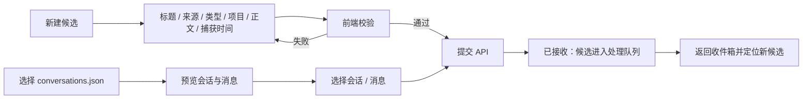
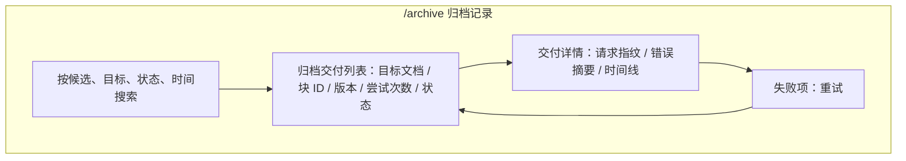
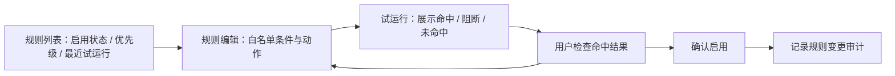
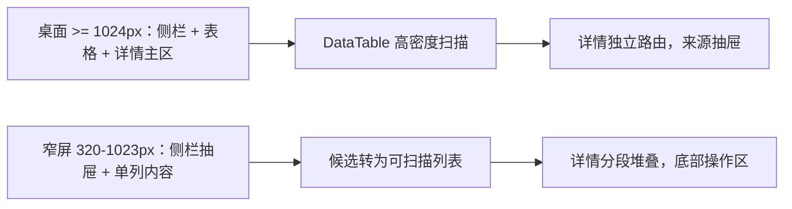

# 前端交互设计图

状态：**已确认，作为 V1 前端开发基线**  
版本：`interaction-v1`  
日期：2026-08-14

本设计基于产品定位、V1 范围、Naive UI 组件约定和 Pinia 状态分层。它只定义管理端信息架构、页面关系、关键流程和状态反馈，不开始业务实现。

静态页面画板：[MemoryHub V1 页面设计图](designs/frontend-pages.html)。画板使用合成数据，仅用于确认页面结构、信息密度和状态表达，不包含业务交互实现。

## 设计目标

- 用户进入系统后先处理候选收件箱，不先看统计仪表盘。
- 每条记忆都能看到来源、处理状态、版本、敏感检查和归档结果。
- 人工操作是可逆、可追溯的；自动归档必须可解释、可试运行。
- 外部服务故障显示为可恢复状态，不阻断来源工具。
- 桌面端优先保证高密度扫描，窄屏端保证操作顺序和关键状态不丢失。

## 信息架构

### 导航结构

| 区域     | 内容                                 | 交互约定                       |
| -------- | ------------------------------------ | ------------------------------ |
| 顶部栏   | 当前页面标题、连接状态、管理员菜单   | 不放业务数据统计，不放密钥内容 |
| 左侧导航 | 收件箱、录入、归档、规则、来源、设置 | 桌面端固定；窄屏端折叠为抽屉   |
| 主内容区 | 当前页面工作内容                     | 页面保持单一主任务             |
| 全局反馈 | Message、Notification、Dialog        | 只反馈动作结果，不替代页面状态 |

## 管理端壳层

壳层规则：

- `NConfigProvider`、`NDialogProvider`、`NMessageProvider`、`NNotificationProvider` 只在应用根节点创建。
- 主题模式、侧栏折叠和信息密度属于 Pinia；页面数据属于 TanStack Vue Query。
- 页面级筛选、排序和分页写入 URL query，刷新后能够恢复。
- 顶部连接状态只展示摘要，例如“思源：已连接 / 待检查 / 不可用”，不显示 Token。

## 候选收件箱

收件箱是默认落点，也是 V1 的最高频页面。

交互规则：

- 默认按“待审核优先、更新时间倒序”排列；实际排序写入 query。
- 行点击进入详情；批量选择只影响当前筛选结果，不隐式选择其他页。
- `conflict`、`sensitive_blocked`、`failed` 等阻断状态必须有文字说明，不只使用颜色。
- 列表加载使用稳定尺寸的 Skeleton；空结果显示 `NEmpty` 和明确的下一步入口。
- 批量批准前展示数量、阻断项和将要执行的动作；包含冲突或敏感阻断的项不能被绕过。

## 候选详情

详情使用独立路由，便于刷新、回链和审计；来源原文使用抽屉或折叠区域展开，避免默认占满主工作区。

动作规则：

- 保存草稿只创建新版本，不直接写入思源。
- “批准并归档”必须经过确认对话框，显示目标笔记本、路径和敏感检查结果。
- 冲突、敏感阻断、低置信度或目标不可用时，主归档动作禁用并解释原因。
- 拒绝需要可选原因；拒绝后保留来源和审计记录。
- 合并只能由用户显式选择目标候选，合并结果创建新版本，不删除原版本。

## 手动录入与导入

- 手动录入和导入都先进入候选处理链，不直接写入思源。
- 导入页面必须显示文件大小、会话数量、已选择数量和校验错误。
- 不读取对话中的链接或附件；导入内容按不可信输入处理。
- 提交成功后显示事件 ID 或候选 ID，便于追踪和重试。

## 归档记录

- `queued`、`processing`、`succeeded`、`retrying`、`dead_letter` 使用标签和文字说明共同表达。
- 成功记录展示思源文档 ID、块 ID、版本和回链。
- 重试操作只重新入队，不创建新的记忆版本或绕过幂等检查。
- 死信项必须进入人工处理路径，不能无限自动重试。

## 规则配置与试运行

- 规则编辑器只提供类型、来源、项目、敏感等级、置信度、冲突状态等白名单字段。
- 试运行只读，不产生真实归档交付。
- 启用规则前展示命中数量、预计目标和阻断数量，并要求显式确认。
- 规则变更和启停都写入审计记录。

## 状态反馈设计

| 状态       | 页面表现                    | 用户动作                   |
| ---------- | --------------------------- | -------------------------- |
| 初始加载   | 稳定尺寸 Skeleton / `NSpin` | 等待；不重复提交           |
| 空状态     | `NEmpty` + 当前页面主入口   | 新建、导入或清除筛选       |
| 校验失败   | 表单字段错误 + `NAlert`     | 修正字段后重试             |
| 网络错误   | `NAlert` + 重试按钮         | 重试，不丢失已填写草稿     |
| 冲突阻断   | `NAlert`，明确冲突版本      | 查看来源、编辑或合并       |
| 敏感阻断   | 错误/警告标签 + 原因        | 脱敏或拒绝，不允许绕过     |
| 已排队     | 状态标签 + 时间线           | 离开页面，稍后查看归档记录 |
| 重试中     | 尝试次数、下次重试时间      | 等待或转人工处理           |
| 已成功归档 | 成功反馈 + 思源块回链       | 打开思源或查看审计         |
| 未保存离开 | `NDialog` 确认              | 保存草稿、放弃或返回       |

反馈原则：页面状态优先于 Toast；Toast 只作为动作完成的补充。任何失败信息都不得显示 Token、原始密钥或完整第三方响应。

## 响应式布局

- 桌面端优先支持批量操作和多列扫描。
- 窄屏端隐藏非关键列，保留标题、状态、来源和更新时间。
- 关键操作保持固定顺序：保存、批准并归档、拒绝；不依赖悬停才能发现。
- 任何状态标签都同时提供文字，不能只依赖颜色。

## 页面与 Naive UI 对照

| 页面能力       | 首选组件                                                 |
| -------------- | -------------------------------------------------------- |
| 应用壳层与导航 | `NLayout`、`NLayoutSider`、`NMenu`、`NPageHeader`        |
| 候选列表       | `NDataTable`、`NInput`、`NSelect`、`NTag`、`NPagination` |
| 候选编辑       | `NForm`、`NInput`、`NSelect`、`NButton`、`NAlert`        |
| 来源与审计     | `NDescriptions`、`NCollapse`、`NTimeline`、`NDrawer`     |
| 确认与反馈     | `NDialog`、`NMessage`、`NNotification`、`NResult`        |
| 空、载入和错误 | `NEmpty`、`NSkeleton`、`NSpin`、`NAlert`                 |
| 规则试运行     | `NForm`、`NDataTable`、`NSwitch`、`NModal`               |

页面按需引入组件，不全局注册全部 Naive UI 组件。

## 已确认设计决策

- [x] “候选收件箱”为登录后的默认页面。
- [x] 候选详情使用独立路由，来源原文使用抽屉或折叠区域展开。
- [x] “批准并归档”使用确认对话框，并在冲突、敏感阻断、低置信度或目标不可用时禁用。
- [x] 规则必须先试运行，再显式启用。
- [x] 本设计作为 V1 前端开发基线；业务页面可以按 V1 开发顺序实现。
