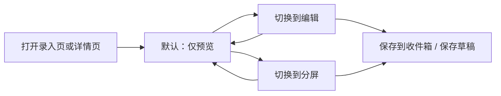

# 记忆正文 Markdown 与排版规范

状态：**已确认，作为 V1 正文编辑/预览与归档观感基线**  
版本：`markdown-format-v1`  
日期：2026-08-15

本文档定义 MemoryHub 管理端的 Markdown 编辑体验、预览风格、emoji 策略，以及归档到思源前的正文排版约定。实现以本文档与 [前端交互设计图](12-frontend-interaction-design.md) 为准。

## 目标

- 候选正文以 Markdown 为唯一真相源，便于版本化、审计和思源归档。
- 审核时先看到接近最终阅读体验的预览，再决定是否进入编辑。
- 归档到思源后结构清晰、可读性强，风格接近“小红书笔记”的轻量信息卡片，而不是纯文本堆砌。
- 手动录入与候选详情复用同一套 Markdown 编辑器与预览组件，避免双套交互。

## 已确认决策

- [x] 正文存储与编辑格式为 Markdown；HTML 仅用于预览渲染，不入库、不直写思源。
- [x] 保留两种排版风格：默认 **小红书笔记风**，可选 **简洁技术风**。
- [x] 两种风格都需要 emoji，用于分区标题与重点提示，不允许做成“无 emoji 纯文本风”。
- [x] 编辑器默认模式为 **仅预览**；用户可切换到编辑或分屏。
- [x] emoji 默认开启；提供关闭开关，但关闭后仍保留风格分区结构。
- [x] 手动录入页与候选详情页使用同一套 Markdown 编辑器组件。
- [x] V1 不支持图片 Markdown；是否支持图片写入 [TODO](TODO.md)，待定。
- [x] 本轮及后续均不实现：LLM 自动润色、完整 WYSIWYG 富文本、小红书图文瀑布流/贴纸引擎、思源回写编辑、自定义 CSS 主题市场。

## 非目标（已删除，不再排期）

以下能力从产品需求中移除，文档与实现均不再保留为后续候选项：

- LLM 一键润色 / 自动改写正文。
- 所见即所得富文本编辑（以 HTML 为真相源）。
- 小红书式多图瀑布流、贴纸层、复杂图文混排引擎。
- 从思源回写正文到 MemoryHub 的双向编辑。
- 用户自定义 CSS 主题市场或任意主题上传。

## 内容模型

| 字段/概念 | 说明 |
| --- | --- |
| `body` | Markdown 源文，候选唯一正文真相源 |
| `render_style` | 排版风格：`xhs_note`（默认）或 `tech_clean` |
| `emoji_enabled` | 是否在模板分区标题中使用 emoji，默认 `true` |

V1 实现要求：

- 若暂未落库 `render_style` / `emoji_enabled`，前端与归档渲染使用上述默认值，并在设置或详情操作区提供可切换控件；一旦切换并保存草稿，需持久化。
- 列表摘要展示时去掉 Markdown 标记后再截断，不直接显示原始语法噪声。
- 保存草稿仍只更新候选正文/版本，不直接写思源。

## Markdown 子集（V1）

允许：

- 标题：`#` 到 `######`
- 段落、粗体、斜体、行内代码、代码块
- 有序/无序列表、任务列表
- 引用、分割线
- 普通链接文本（预览可显示，不自动抓取外链内容）

禁止 / 不支持：

- 图片语法 ``（V1 直接拒绝或提示不支持，见 [TODO](TODO.md)）
- 原始 HTML 标签作为可执行内容
- 脚本、事件属性、`javascript:` 链接
- 自动下载附件或跟随导入内容中的外链

## 排版风格

### 1. 小红书笔记风（默认，`xhs_note`）

适合长期记忆的快速扫读：

- 短段落、重点前置
- 分区小标题带 emoji
- 引用块用于“一句话总结”
- 列表承载要点与可执行项
- 预览区使用卡片式留白、舒适行距和轻阴影

推荐结构：

```markdown
# 🌟 {title}

> 💡 一句话：{one_liner}

## 📌 关键点
- ...

## 🧠 为什么重要
...

## ✅ 后续可执行
- [ ] ...
```

### 2. 简洁技术风（`tech_clean`）

适合决策、项目上下文与工程记录：

- 分区更克制，但仍保留 emoji 分区标题
- 更强调结论、背景、约束、影响
- 预览区更像技术笔记，信息密度略高

推荐结构：

```markdown
# 🧩 {title}

> ✅ 结论：{conclusion}

## 📌 背景
...

## 🔍 关键细节
- ...

## ⚠️ 约束与影响
- ...
```

### 类型模板映射

| memoryType | 默认结构侧重点 |
| --- | --- |
| `preference` | 偏好结论 / 适用场景 / 反例 |
| `decision` | 决策结论 / 背景 / 取舍 / 影响 |
| `project_context` | 项目背景 / 约束 / 关键路径 |
| `permanent_fact` | 事实陈述 / 适用范围 / 来源 |
| `temporary_state` | 当前状态 / 有效期 / 下一步 |
| `todo` | 目标 / 步骤 / 检查项 |
| `sensitive` | 仅人工处理；预览需明确敏感提示，不自动套活泼模板文案淡化风险 |

“套用模板”只重组结构与分区标题，不擅自改写用户事实内容。已有正文时必须二次确认。

## Emoji 策略

- 默认开启。
- **小红书笔记风** 与 **简洁技术风** 均使用 emoji；差别在分区文案与密度，而不是有无 emoji。
- 每个分区标题最多 1 个 emoji。
- 正文段落不自动批量插入 emoji；用户可手动插入。
- 关闭 emoji 后：
  - 模板与预览去掉分区 emoji
  - 保留标题层级、列表和引用结构
- 提供常用 emoji 快捷插入（标题/要点/警告/完成等），避免无约束刷屏。

## 编辑器交互（必须实现）

### 共享组件

手动录入 `/capture` 与候选详情 `/inbox/:candidateId` 使用同一组件，例如 `MemoryMarkdownEditor`：

- 模式切换：`仅预览` / `编辑` / `分屏`
- 默认模式：**仅预览**
- 工具栏：标题、加粗、列表、引用、代码、分割线、常用 emoji、套用模板、风格切换、emoji 开关
- 字数统计与 20,000 上限提示
- 加载、空内容、错误、只读态

### 默认与切换规则



- 首次进入或刷新后回到 **仅预览**，不记忆为跨会话强制编辑态。
- 窄屏默认仍是仅预览；进入编辑时采用单栏编辑，不强制分屏。
- 已批准 / 已拒绝 / 已归档：默认仅预览，且不可编辑；可查看源码但不提供模板覆盖。
- 待审核：预览中提供“编辑正文”入口，明确切换到编辑或分屏。

### 预览体验

- 预览必须先做 HTML 清洗，再渲染。
- 预览皮肤随 `render_style` 变化：
  - `xhs_note`：卡片、更大标题、活泼分区
  - `tech_clean`：紧凑标题、技术笔记气质
- 预览空态文案：“还没有正文，切换到编辑开始写记忆”。
- 不支持图片时，若源文含图片语法，预览显示明确警告，不渲染图片。

### 套用模板

- 入口文案：`套用模板`
- 选择当前风格对应模板（并尊重 emoji 开关）
- 空正文：直接填入模板骨架
- 非空正文：`NDialog` 确认“将按模板重排结构，可继续手改”
- 套用结果先进入编辑区，不自动保存

### 保存与审核动作

- 录入页：保存到收件箱时提交 Markdown `body` 与当前风格设置
- 详情页：保存草稿只持久化正文/风格，不写思源
- 批准 / 拒绝逻辑保持既有状态机；批准前用户应能在仅预览模式下确认观感

## 思源归档观感

归档交付（后续人工闭环的归档步骤）时：

- 使用候选 Markdown 源文作为主体
- 按当前 `render_style` 与 `emoji_enabled` 规范化分区标题
- 追加可追溯页脚（memory id、版本、来源、捕获时间、MemoryHub 回链）
- 继续通过思源 Markdown API 写入，不直接改 `.sy`

管理端预览应尽量接近思源最终阅读结构，但允许思源主题造成的视觉差异。

## 安全要求

- 所有预览渲染前清洗 HTML。
- 禁止危险协议与脚本。
- 用户正文不得被当作可执行模板或规则脚本。
- 不自动抓取、下载或代理正文中的外链资源。
- 严格私密内容的既有拦截策略不变。

## 测试要求

- 组件测试：默认仅预览、切换编辑/分屏、模板套用确认。
- 安全测试：恶意 HTML / `javascript:` 链接不会被执行。
- 摘要测试：列表页不显示原始 `##`、`**` 等噪声。
- 风格测试：两种风格都能输出带 emoji 的分区标题；关闭 emoji 后标题无 emoji。
- 图片语法：V1 给出不支持提示，不渲染图片。

## 实现边界

本轮开发范围：

1. 共享 Markdown 编辑/预览组件
2. 详情页与手动录入页接入
3. 两种风格 + emoji 开关 + 模板套用
4. 列表摘要去 Markdown 标记
5. 安全清洗与测试
6. 本文档与交互文档同步

不在本能力内实现：思源实际投递（仍归属归档交付功能块），以及 [非目标](#非目标已删除不再排期) 中已删除项。
