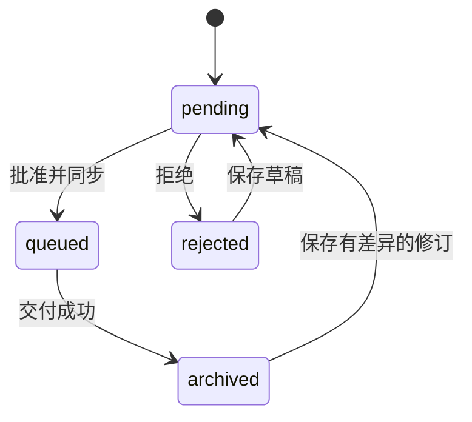

# 记忆修订、同步与版本历史

状态：**待确认**  
版本：`revision-v1`  
日期：2026-08-20  
关联：[产品设计](02-product-design.md)、[领域模型](04-domain-data-model.md)、[V1 范围](06-v1-scope.md)、[交互设计](12-frontend-interaction-design.md)、[ADR-0006](adr/0006-memory-revision-and-siyuan-update.md)

本设计解决两个问题：已同步到思源的记忆如何继续修改；如何查看和比对历史版本。实现按两步交付，先打通修订主链路，再补版本查看与 diff。

## 1. 产品判断

记忆不是一次性归档物，而是会持续修正的活文档。PostgreSQL 保存身份、工作副本、版本和交付状态；思源保存当前人类可读正文。

术语约定：

| 内部状态 / 字段 | 界面文案 | 含义 |
| --- | --- | --- |
| `synced` | 已同步 | 最近一次批准版本已成功写入思源 |
| `queued` | 同步中 | 已批准，Worker 正在写入或重试 |
| `pending` | 待审核 | 从未同步，或已同步后再次修改 |
| 批准并归档 | 批准并同步 | 创建新版本并入队写思源 |
| 归档记录 | 已同步记忆 | 列出最近一次成功同步的记忆 |

候选状态从 `archived` 重命名为 `synced`，并迁移已有数据。交付表名仍为 `archive_deliveries`，表示对思源的投递记录。

## 2. 设计原则

- 候选 ID 稳定，内容变化只追加 `memory_versions`，禁止原地改历史。
- 工作副本在 `memory_candidates.title/body/...`；`current_version_id` 只指向最近一次成功同步的版本。
- 每个版本一次交付：唯一键仍是 `memory_version_id + target_id`。
- 同一候选在同一思源目标上只有一份文档。后续修订更新原文档，不新建、不追加副本。
- API 不在请求内写思源。批准只落库并入队，Worker 负责幂等更新。
- 思源写失败可重试；成功记录不可静默删除。修订通过新版本和新交付补偿。
- 版本比对只比较已落库版本，不把未保存草稿当作正式版本。
- 前端不展示 Token、原始密钥或第三方原始响应。

## 3. 状态机

```text
pending --批准--> queued --交付成功--> archived
queued --交付失败/死信--> queued 或保持 queued，交付进入 retrying / dead_letter
synced --保存有差异的草稿--> pending
rejected --保存草稿--> pending
pending --拒绝--> rejected
conflict --人工处理后--> pending
```

规则：

1. 仅 `pending` 可批准。已同步记忆要先保存差异草稿，状态回到 `pending`，再批准。
2. `PATCH` 在 `archived` 上若内容哈希相对 `current_version` 发生变化，将状态改为 `pending`，不立刻创建版本。
3. `PATCH` 在 `archived` 上若内容未变，保持 `archived`。
4. 批准时按当前工作副本创建 `version_number = max + 1` 的新版本。
5. 若该候选在目标上已有成功交付，新交付携带既有 `document_id`，Worker 走更新路径。
6. 工作副本与 `current_version` 一致且最近交付成功时，状态才是 `archived`。



## 4. 修订主链路

### 4.1 编辑已同步记忆

详情页对 `archived` 默认只读预览。用户点击「编辑此记忆」进入编辑态，工作副本仍在候选行上修改。

保存草稿：

- 校验与现有 `PATCH /candidates/:id` 相同。
- 计算工作副本哈希。
- 与 `current_version.content_hash` 不同则 `status = pending`，并写审计 `candidate.revise`。
- 不创建 `memory_versions`。版本只在批准时产生，避免未审核草稿污染版本链。

### 4.2 批准并同步

`POST /candidates/:id/approve` 保持「API 只落库」：

同一事务内：

1. 校验状态为 `pending`。
2. 目标可用且笔记本已配置。
3. 插入新 `memory_versions`。
4. 查找同一 `candidate_id + target_id` 最近一次 `succeeded` 交付；若有则把其 `document_id/path` 预填到新交付（可空字段，Worker 再确认）。
5. 插入新 `archive_deliveries`，状态 `queued`。
6. 候选状态改为 `queued`，`current_version_id` 暂不切换；成功后再切到新版本。
7. 写审计 `candidate.approve` 和 outbox。

成功交付后：

- 候选 `status = archived`
- `current_version_id =` 新版本
- 旧版本保留，不删除

### 4.3 Worker 写思源

`executeSiyuanArchive` 改为：

| 情况 | 动作 |
| --- | --- |
| 无既有 `documentId` | `createDocWithMd`，路径 `/MemoryHub/{group}/{title}` |
| 有既有 `documentId` 且文档仍存在 | `updateBlock` 用整篇 Markdown 覆盖根文档 |
| 标题变化导致路径最后一段变化 | 先更新正文，再调用思源重命名/移动 API；失败时正文已更新，路径变更记可重试错误，不重复创建 |
| 文档在思源被删 | 视为缺失，重新 `createDocWithMd`，写入新 `document_id` |
| 重试同一 `delivery` | 先读交付状态；已成功则直接返回；未成功则按指纹更新同一文档 |

禁止对已有文档 `appendBlock`。追加会把整篇记忆再贴一遍，造成重复正文。

路径与标题：

- 文档名始终来自 `{title}`。
- 分组来自 `{group}`，修订不改变来源组；`manual` 仍在「手动归档」，对话来源仍在「对话保存」。
- 不自动把旧文档从 `/MemoryHub/长期记忆/project_context` 搬迁；只保证新修订更新原 `document_id` 对应文档。

### 4.4 幂等与冲突

- 同一版本对同一目标只允许一条交付。
- 内容未变时，UI 不鼓励再次批准；API 若检测到工作副本哈希等于 `current_version`，返回 `409 CANDIDATE_NO_CHANGES`。
- 自动规则不得在用户正在修订的 `pending` 记忆上抢先同步。
- 标题变更只影响思源路径展示，不改变候选 ID。

## 5. 版本历史与比对

### 5.1 数据

`memory_versions` 已具备标题、正文、类型、项目、哈希和时间。本阶段不新增表。

展示字段：

- `versionNumber`
- `title`
- `contentHash`
- `createdAt`
- `synced`：是否存在对应成功交付
- `documentId` / `path`：若已同步

工作副本不是版本。若 `pending` 且哈希不同于当前版本，界面单独显示「未同步修订」。

### 5.2 API

```text
GET /api/v1/candidates/:candidateId/versions
GET /api/v1/candidates/:candidateId/versions/:versionId
GET /api/v1/candidates/:candidateId/versions/compare?from=:versionId&to=:versionId
```

`compare` 响应：

```ts
{
  from: VersionSummary
  to: VersionSummary
  fields: Array<{
    field: 'title' | 'body' | 'memoryType' | 'project' | 'renderStyle' | 'emojiEnabled'
    changed: boolean
    from: string | boolean | null
    to: string | boolean | null
  }>
  bodyHunks: Array<{
    type: 'equal' | 'add' | 'remove'
    fromStart: number
    toStart: number
    lines: string[]
  }>
}
```

比对算法：

- 元数据做字段级全等比较。
- 正文按行做 Myers diff，服务端计算，前端只渲染。
- 不在浏览器跑不可信 HTML diff，不把 Markdown 先转 HTML 再比。
- 单次比对正文上限与候选正文上限一致；超限拒绝并提示拆分。

默认比对：最新两个已落库版本。若只有 v1，提供 v1 与当前工作副本的只读预览，但不生成正式 compare 记录。

### 5.3 不做什么

- 不做三方合并、自动 rebase、版本回滚覆盖。
- 「恢复此版本」只把该版本内容拷回工作副本并进入 `pending`，仍需再次批准才会同步思源。
- 不做思源历史作为真相源。思源只保留最新正文。

## 6. 前端信息架构

新增/调整路由：

| 路由 | 页面 | 说明 |
| --- | --- | --- |
| `/archives` | 已同步记忆 | 原归档记录，文案调整 |
| `/inbox/:candidateId` | 记忆详情 | 同时服务待审核与已同步 |
| `/inbox/:candidateId?edit=1` | 详情编辑态 | 已同步记忆点「编辑此记忆」后进入 |
| `/inbox/:candidateId/compare` | 版本比对 | `from` / `to` 走 query |

导航「归档记录」改为「已同步记忆」。收件箱仍是默认工作页；已同步且无未审核修订的记忆主要出现在「已同步记忆」，若又被改成 `pending` 则回到收件箱。

## 7. 页面设计

### 7.1 记忆详情 · 已同步只读

顶部：返回、状态「已同步」、当前版本 `vN`、思源路径。

主区：现有 Markdown 预览，默认只读。

右侧或正文下方增加「版本历史」列表：vN 当前已同步、vN-1 … v1。每项显示时间和是否已同步。

底部固定操作：

- 返回列表
- 查看比对（至少 2 个版本时可用）
- 编辑此记忆

交付面板保留，成功项展示文档 ID / 块 ID / 路径，文案改为「同步记录」。

### 7.2 记忆详情 · 修订编辑

从已同步进入编辑后：

- 出现信息条：「这是已同步记忆的修订。保存后将重新进入待审核，不会立即改思源。」
- 表单与 Markdown 编辑器解锁，规则与待审核详情相同。
- 底部：保存修订、取消编辑、批准并同步。
- 「批准并同步」在未保存差异时禁用；保存后可用。
- 批准确认框展示：旧版本号、新内容摘要、将更新的思源文档（不是新建）。

### 7.3 版本比对页

布局为双栏加顶部选择器。

顶部：`对比 v2 → v3`，两个版本选择器，可交换。

上方变更摘要：标题、类型、项目等字段的新旧值。

下方正文 diff：

- 默认统一视图（unified），可切并排（split）
- 删除行红底，新增行绿底
- 行号可见
- 不渲染 Markdown HTML，按源文本比对，避免样式干扰判断

操作：返回详情、恢复为工作副本（二次确认）。

### 7.4 已同步记忆列表

卡片增加：

- 状态「已同步」
- 当前版本号
- 思源路径摘要
- 若该记忆又变成 `pending`，它离开本列表，回到收件箱，并带标签「修订待同步」

### 7.5 交互状态

| 场景 | 表现 |
| --- | --- |
| 已同步只读 | 预览 + 「编辑此记忆」 |
| 修订未保存离开 | Dialog：保存修订 / 放弃 / 返回 |
| 保存修订 | Toast「已保存，等待再次同步」+ 状态变待审核 |
| 批准并同步 | Dialog 确认将更新已有思源文档 |
| 同步中 | 状态「同步中」，编辑入口暂时关闭 |
| 无变化批准 | 按钮禁用，说明「内容与已同步版本相同」 |
| 版本不足比对 | 比对按钮禁用，「至少需要两个正式版本」 |

## 8. 开发顺序

### 第一步：修订主链路

1. 扩展 `PATCH`：允许 `archived` 保存差异并回到 `pending`。
2. 扩展 `approve`：创建下一版本，关联既有 `document_id`。
3. Worker / `core`：有文档则更新，无文档则创建；去掉对已有文档的 append。
4. 详情页：已同步可编辑；文案改为同步；确认框说明更新原文档。
5. 测试：首次同步、二次修订更新同一文档、无变化拒绝、文档缺失时重建、重试不重复创建。

### 第二步：版本历史与比对

1. 版本列表/详情/compare API 与契约。
2. 详情页版本历史。
3. 比对页与 query 状态。
4. 「恢复为工作副本」。
5. 测试：顺序版本、交叉选择、仅一版、字段级变更、正文增删改。

## 9. 测试要点

- 首次批准创建 v1 和思源文档。
- 编辑已同步记忆不立刻改思源。
- 第二次批准创建 v2，Worker 对同一 `document_id` 调用更新。
- 重试 v2 不产生第二份文档。
- 思源文档被删后，v3 允许重建并记录新 ID。
- compare(v1, v2) 对标题和正文变更稳定可复现。
- 前端不在 Pinia 中缓存版本全文。

## 10. 待确认后实现

本文件与页面画板更新后，需确认：

- [ ] 接受「归档」在界面改为「同步」，内部状态改为 `synced`。
- [ ] 接受「先保存修订再批准」，不在编辑时直接写思源。
- [ ] 接受修订更新原思源文档，不新建、不追加。
- [ ] 接受版本历史作为第二步，不与修订主链路混在一个提交里做完。
